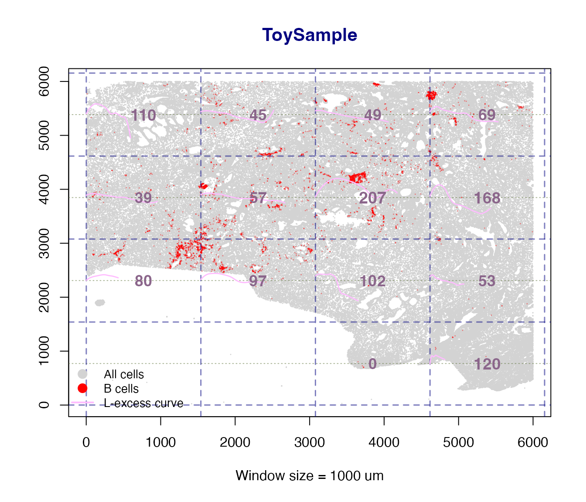
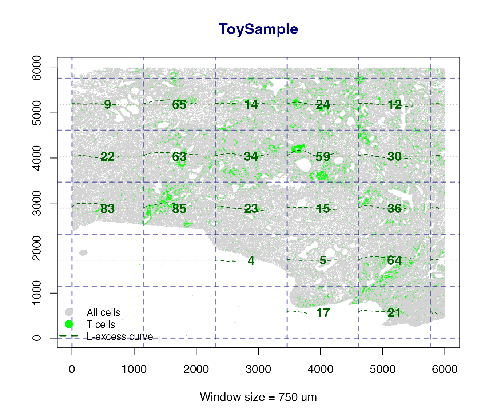

# tlsR Workflow: From Quntified Cell Feature Table of the Imaging Data to TLS Characterisation

## Introduction

Tertiary lymphoid structures (TLS) are ectopic lymphoid organs that form
in non-lymphoid tissues – most notably in tumors – and are associated
with improved patient outcomes and immunotherapy response. **tlsR**
provides a fast, reproducible pipeline for detecting TLS and
characterizing their spatial organisation in multiplexed tissue imaging
data (e.g. mIHC, CODEX, IMC).

The core pipeline is:

    Raw ldata list
         |
         v
    detect_TLS()        <- KNN-based B+T co-localisation
         |
         +--> scan_clustering()   <- Sliding-window Ripley's L clustering map
         |
         +--> calc_icat()         <- ICAT spatial-spread score per TLS
         |
         +--> detect_tic()        <- T-cell clusters outside TLS
         |
         +--> summarize_TLS()     <- Tidy summary table
         |
         +--> plot_TLS()          <- Publication-ready spatial plot

------------------------------------------------------------------------

## Data Format

`tlsR` expects a **named list of data frames** (`ldata`), one element
per tissue sample. Each data frame must contain at minimum:

| Column      | Type      | Description                                      |
|-------------|-----------|--------------------------------------------------|
| `x`         | numeric   | X coordinate in microns                          |
| `y`         | numeric   | Y coordinate in microns                          |
| `phenotype` | character | Cell label; must contain `"B cell"` / `"T cell"` |

Additional columns (e.g. cell area, marker intensities) are silently
ignored.

``` r
library(tlsR)

data(toy_ldata)

# Structure of the built-in example dataset
str(toy_ldata)
#> List of 1
#>  $ ToySample:'data.frame':   322951 obs. of  4 variables:
#>   ..$ x        : int [1:322951] 423 355 731 814 1415 1847 2623 2626 2625 3433 ...
#>   ..$ y        : int [1:322951] 234 460 38 420 24 54 353 353 357 30 ...
#>   ..$ cflag    : int [1:322951] 0 0 0 0 0 0 0 0 0 0 ...
#>   ..$ phenotype: chr [1:322951] "Others" "Others" "Others" "Others" ...
table(toy_ldata[["ToySample"]]$phenotype)
#> 
#>           B cells Endothelial cells     Myeloid cells            Others 
#>              4446             15843             35189            150350 
#>     Stromal cells           T cells 
#>            106412             10711
```

------------------------------------------------------------------------

## Step 1 – Detect TLS with `detect_TLS()`

[`detect_TLS()`](https://amiryousefilab.github.io/tlsR/reference/detect_TLS.md)
identifies B-cell-rich regions with sufficient T-cell co-localisation
using a KNN density approach.

``` r
data(toy_ldata)

ldata <- detect_TLS(
  LSP                     = "ToySample",
  k                       = 10,     # neighbours for density estimation
  bcell_density_threshold = 17,     # min avg 1/k-distance (um)
  min_B_cells             = 100,    # min B cells per candidate TLS
  min_T_cells_nearby      = 5,      # min T cells within max_distance_T
  max_distance_T          = 50,     # search radius (um)
  expand_distance         = 100,    # expanding radius
  ldata                   = toy_ldata
)
#> Detected TLS: 5

table(ldata[["ToySample"]]$tls_id_knn)
#> 
#>      0      1      2      3      4      5 
#> 317892    568    533    414   2250   1294
```

The new column `tls_id_knn` is `0` for non-TLS cells and a positive
integer for cells assigned to TLS 1, 2, 3, … .

### Quick base-R check plot

``` r
df <- ldata[["ToySample"]]

plot(df$x[df$tls_id_knn == 0],
     df$y[df$tls_id_knn == 0],
     col  = "grey80", pch = 19, cex = 0.3,
     xlab = "x (um)", ylab = "y (um)",
     main = "Detected TLS -- ToySample")

points(df$x[df$tls_id_knn > 0],
       df$y[df$tls_id_knn > 0],
       col = "#0072B2", pch = 19, cex = 0.4)

legend("bottomright",
       legend = c("Background", "TLS"),
       col    = c("grey80", "#0072B2"),
       pch    = 19, pt.cex = 1.2, bty = "n")
```


------------------------------------------------------------------------

## Step 2 – Local Ripley’s L Map with `scan_clustering()`

[`scan_clustering()`](https://amiryousefilab.github.io/tlsR/reference/scan_clustering.md)
slides a square window across the tissue and computes the **K-integral**
clustering index in each window – the mean positive excess of the
observed Ripley’s L over the theoretical CSR value.

When `plot = TRUE` (the default) a spatial map is produced showing:

- All cells as small light-grey points.
- Phenotype cells coloured green (T cells) or red (B cells).
- A navy dashed grid marking window boundaries.
- A LOESS-smoothed L-excess curve overlaid inside each qualifying
  window.
- A bold numeric clustering-intensity (CI) label centred in each window.
- A legend identifying all point and curve colours.

### Single-phenotype map

``` r
# eval=FALSE because this can take ~10--30 s on real data
L_B <- scan_clustering(
  ws             = 1000,        # window side (um)
  sample         = "ToySample",
  phenotype      = "B cells",
  plot           = TRUE,
  creep          = 1L,
  min_cells      = 10L,
  min_phen_cells = 5L,
  label_cex      = 1.1,        # increase if CI labels look small
  ldata          = ldata
)
```



    #> scan_clustering [B cells]: 14 window(s) analysed in 'ToySample'.

    cat("B-cell windows analysed:", length(L_B$B), "\n")
    #> B-cell windows analysed: 14

``` r
L_T <- scan_clustering(
  ws        = 750,
  sample    = "ToySample",
  phenotype = "T cells",
  plot      = TRUE,
  ldata     = ldata
)
```



    #> scan_clustering [T cells]: 31 window(s) analysed in 'ToySample'.

    cat("T-cell windows analysed:", length(L_T$T), "\n")
    #> T-cell windows analysed: 31

### Side-by-side B and T cell panels

When `phenotype = "Both"` two panels are drawn side by side – one for B
cells and one for T cells – with a shared super-title, making it easy to
compare clustering intensity across compartments.

``` r
L_both <- scan_clustering(
  ws        = 3000,
  sample    = "ToySample",
  phenotype = "Both",
  plot      = TRUE,
  ldata     = ldata
)

cat("B windows:", length(L_both$B), " | T windows:", length(L_both$T), "\n")
```

The returned list has named elements `$B` and `$T`, each containing
`Lest` objects for the qualifying windows of that phenotype. Individual
L curves can be inspected or plotted directly from these objects.

------------------------------------------------------------------------

## Step 3 – ICAT Score with `calc_icat()`

The **ICAT (Immune Cell Arrangement Trace)** index quantifies the
spatial spread and linear organisation of cells within a TLS. A higher
value indicates a more spatially extended, structured cluster.

### How it works

[`calc_icat()`](https://amiryousefilab.github.io/tlsR/reference/calc_icat.md)
applies FastICA to the centred (x, y) coordinates of TLS cells,
reconstructs the data as $`\hat{X} = S A^T + \mu`$, and computes the
normalised trace-standard-deviation:
``` math

  \text{ICAT} = 100 \times
    \frac{\sqrt{v_1 + v_2 + 2\sqrt{v_1 v_2}}}{\text{nrow}(X)}
```
where $`v_1, v_2`$ are the marginal variances of $`\hat{X}`$. This
formulation is **always non-negative** – it reflects average spatial
spread per cell in microns, rather than the signed trace of the raw
mixing matrix which can be negative due to ICA sign ambiguity.

``` r
n_tls <- max(ldata[["ToySample"]]$tls_id_knn, na.rm = TRUE)

if (n_tls >= 1L) {
  icat_scores <- vapply(
    seq_len(n_tls),
    function(id) calc_icat("ToySample", tlsID = id, ldata = ldata),
    numeric(1L)
  )
  names(icat_scores) <- paste0("TLS", seq_len(n_tls))
  print(icat_scores)
}
#>      TLS1      TLS2      TLS3      TLS4      TLS5 
#> 15.970299 17.608423 21.741182  4.301720  6.282444
```

[`calc_icat()`](https://amiryousefilab.github.io/tlsR/reference/calc_icat.md)
returns `NA` (with a message) if a TLS has too few cells or if FastICA
fails to converge – no errors are thrown.

------------------------------------------------------------------------

## Step 4 – Detect T-cell Clusters with `detect_tic()`

T-cell clusters (TIC) that lie *outside* TLS are identified with
HDBSCAN. The `min_pts` and `min_cluster_size` arguments let you control
sensitivity.

``` r
ldata <- detect_tic(
  sample           = "ToySample",
  min_pts          = 20,    # HDBSCAN minPts
  min_cluster_size = 100,   # drop clusters smaller than this
  ldata            = ldata
)
#> detect_tic: 14 T-cell cluster(s) detected in 'ToySample'.

table(
  ldata[["ToySample"]]$tcell_cluster_hdbscan[
    ldata[["ToySample"]]$tcell_cluster_hdbscan != 0
  ],
  useNA = "ifany"
)
#> 
#>      1      2      3      4      5      6      7      8      9     10     11 
#>    117    117    102    129    253    209    173    117    189    141    105 
#>     12     13     14   <NA> 
#>    386    110    219 312966
```

------------------------------------------------------------------------

## Step 5 – Summary Table with `summarize_TLS()`

[`summarize_TLS()`](https://amiryousefilab.github.io/tlsR/reference/summarize_TLS.md)
produces a tidy one-row-per-sample summary – convenient for downstream
statistical analysis.

``` r
sumtbl <- summarize_TLS(ldata, calc_icat_scores = FALSE)
print(sumtbl)
#>      sample n_TLS total_cells TLS_cells TLS_fraction mean_TLS_size n_TIC
#> 1 ToySample     5      322951      5059   0.01566492        1011.8    14
```

With `calc_icat_scores = TRUE` a list-column `icat_scores` is appended
containing named numeric vectors of per-TLS ICAT values (always
non-negative).

------------------------------------------------------------------------

## Step 6 – Visualise with `plot_TLS()`

[`plot_TLS()`](https://amiryousefilab.github.io/tlsR/reference/plot_TLS.md)
produces a ggplot2 scatter plot with TLS and TIC coloured distinctly
using a colourblind-friendly palette.

### Rendering improvements

Two aesthetics have been tuned for clarity:

- **Background cells** are drawn with `bg_alpha = 0.25` (more
  transparent than before), so the foreground TLS and TIC structure is
  immediately visible.
- **TIC cells** are drawn at `point_size * tic_size_mult` (default
  multiplier `1.8x`), making them slightly larger than TLS cells without
  dominating the plot.

Both parameters are fully exposed as function arguments so you can
fine-tune them for your data density.

``` r
p <- plot_TLS(
  sample        = "ToySample",
  ldata         = ldata,
  show_tic      = TRUE,
  point_size    = 0.5,
  alpha         = 0.7,     # TLS / TIC cells
  bg_alpha      = 0.25,    # background cells (more transparent)
  tic_size_mult = 0.8      # TIC cells drawn 1.8x larger
)
```

The returned `ggplot` object can be further customised with standard
ggplot2 functions:

``` r
library(ggplot2)
p + labs(title = "ToySample -- Your custom title")
```


------------------------------------------------------------------------

## Multi-Sample Workflow

`tlsR` is designed to scale naturally to many samples. Simply pass your
full `ldata` list and iterate:

``` r
samples <- names(ldata)

ldata <- Reduce(function(ld, s) detect_TLS(s, ldata = ld), samples, ldata)
ldata <- Reduce(function(ld, s) detect_tic(s,  ldata = ld), samples, ldata)

summary_all <- summarize_TLS(ldata)
print(summary_all)
```

For
[`scan_clustering()`](https://amiryousefilab.github.io/tlsR/reference/scan_clustering.md)
across many samples:

``` r
# Generate one spatial map per sample (side-by-side B and T panels)
for (s in names(ldata)) {
  scan_clustering(
    ws        = 500,
    sample    = s,
    phenotype = "Both",    # two-panel plot: B cells | T cells
    plot      = TRUE,
    label_cex = 1.2,       # slightly larger CI labels for presentation
    ldata     = ldata
  )
}
```

------------------------------------------------------------------------

## Session Info

``` r
sessionInfo()
#> R version 4.5.2 (2025-10-31)
#> Platform: aarch64-apple-darwin20
#> Running under: macOS Tahoe 26.3.1
#> 
#> Matrix products: default
#> BLAS:   /System/Library/Frameworks/Accelerate.framework/Versions/A/Frameworks/vecLib.framework/Versions/A/libBLAS.dylib 
#> LAPACK: /Library/Frameworks/R.framework/Versions/4.5-arm64/Resources/lib/libRlapack.dylib;  LAPACK version 3.12.1
#> 
#> locale:
#> [1] en_US.UTF-8/en_US.UTF-8/en_US.UTF-8/C/en_US.UTF-8/en_US.UTF-8
#> 
#> time zone: America/New_York
#> tzcode source: internal
#> 
#> attached base packages:
#> [1] stats     graphics  grDevices utils     datasets  methods   base     
#> 
#> other attached packages:
#> [1] ggplot2_4.0.2 tlsR_0.3.0   
#> 
#> loaded via a namespace (and not attached):
#>  [1] sass_0.4.10            generics_0.1.4         spatstat.explore_3.8-0
#>  [4] tensor_1.5.1           spatstat.data_3.1-9    lattice_0.22-9        
#>  [7] digest_0.6.39          magrittr_2.0.5         spatstat.utils_3.2-2  
#> [10] evaluate_1.0.5         grid_4.5.2             RColorBrewer_1.1-3    
#> [13] fastmap_1.2.0          jsonlite_2.0.0         Matrix_1.7-5          
#> [16] spatstat.sparse_3.1-0  scales_1.4.0           textshaping_1.0.5     
#> [19] jquerylib_0.1.4        abind_1.4-8            cli_3.6.6             
#> [22] rlang_1.2.0            polyclip_1.10-7        fastICA_1.2-7         
#> [25] withr_3.0.2            cachem_1.1.0           yaml_2.3.12           
#> [28] otel_0.2.0             spatstat.univar_3.1-7  FNN_1.1.4.1           
#> [31] tools_4.5.2            deldir_2.0-4           dplyr_1.2.1           
#> [34] spatstat.geom_3.7-3    vctrs_0.7.3            R6_2.6.1              
#> [37] lifecycle_1.0.5        fs_2.0.1               htmlwidgets_1.6.4     
#> [40] dbscan_1.2.4           ragg_1.5.2             pkgconfig_2.0.3       
#> [43] desc_1.4.3             pkgdown_2.2.0          bslib_0.10.0          
#> [46] pillar_1.11.1          gtable_0.3.6           glue_1.8.0            
#> [49] Rcpp_1.1.1-1           systemfonts_1.3.2      xfun_0.57             
#> [52] tibble_3.3.1           tidyselect_1.2.1       rstudioapi_0.18.0     
#> [55] knitr_1.51             dichromat_2.0-0.1      goftest_1.2-3         
#> [58] farver_2.1.2           nlme_3.1-169           spatstat.random_3.4-5 
#> [61] htmltools_0.5.9        labeling_0.4.3         rmarkdown_2.31        
#> [64] compiler_4.5.2         S7_0.2.1-1
```
